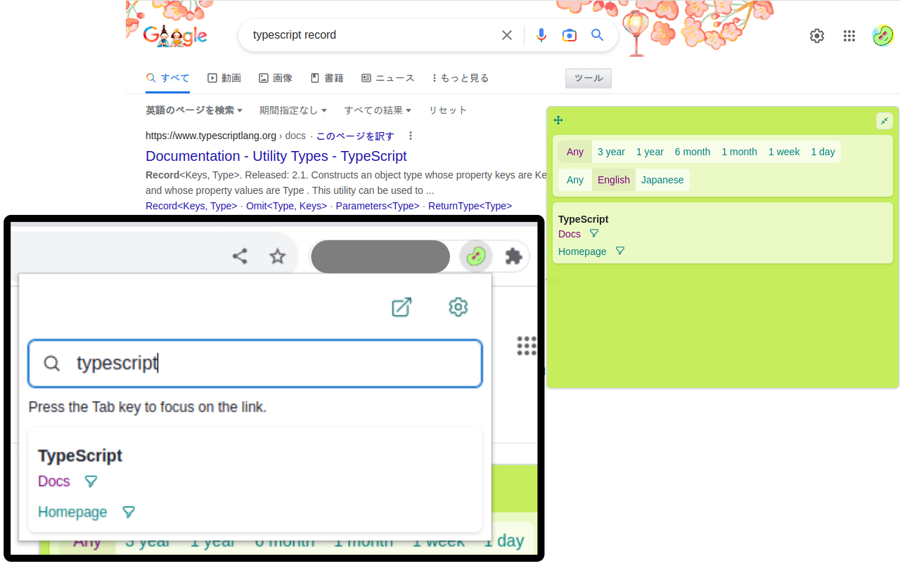
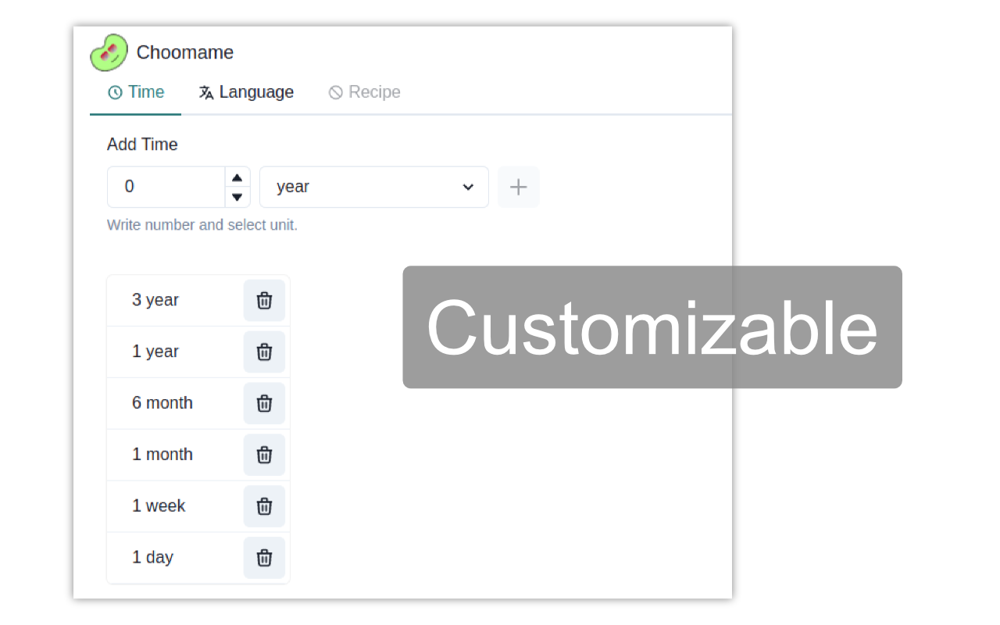

  

# Choomame

Choomame (チューマメ) is a browser extension that add amazing information to search results and Popup.

**You can install at [Chrome Web Store](https://chrome.google.com/webstore/detail/lecnbgonlcmmpkpnngbofggjiccbnokn)!**

This extension is an improved versioin of my previous extension Amazing Searcher([Chrome Web Store](https://chrome.google.com/webstore/detail/amazing-searcher/poheekmlppakdboaalpmhfpbmnefeokj),

[GitHub](https://github.com/eetann/amazing-searcher))

Choomame shows the following link to Popup and the Google search results.

- `Time`: restrict results to a specific time period
  - example: 3 years, 1 month, 1 week ...
- `Language`: restrict results to a specific language
  - example: English, Japanese, Spanish ...
- `Custom Link`: easy access to frequently viewed pages, site searches, official documents
  - Check [choomame-custom-link-collection](https://github.com/eetann/choomame-custom-link-collection#readme) for details.

These can be freely customized on the option page.

## Shortcut key

If you want to use a shortcut key to open a popup, type `Ctrl(Command) + q`. This shortcut key can be assigned freely at `chrome://extensions/shortcuts'.

In Vivaldi, it is not available, so I have added `Alt+Q` to open a tab instead of popup. It might be useful to register it as a web panel.
