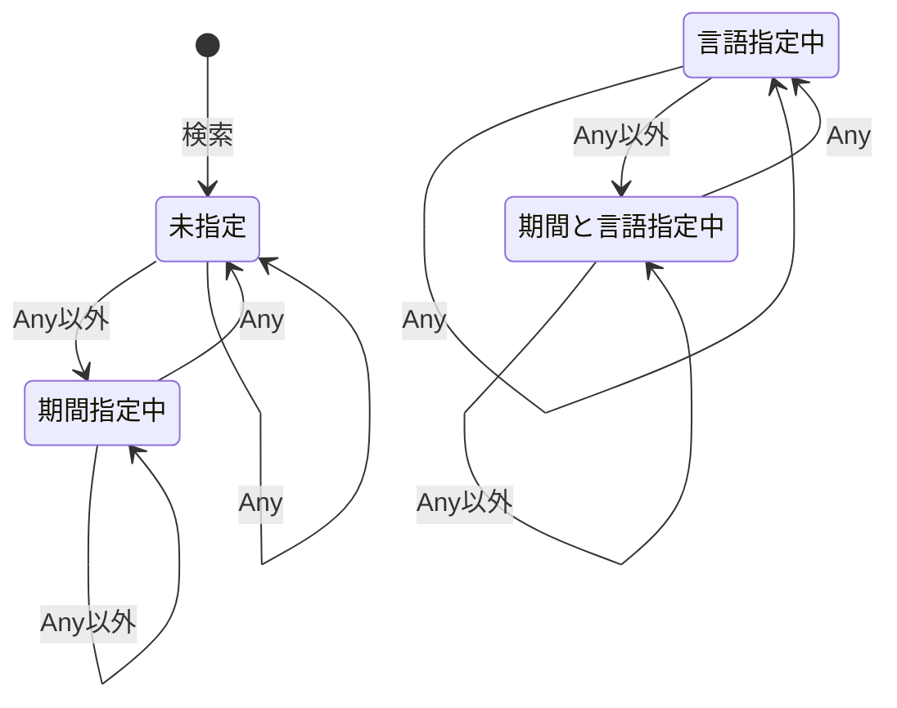
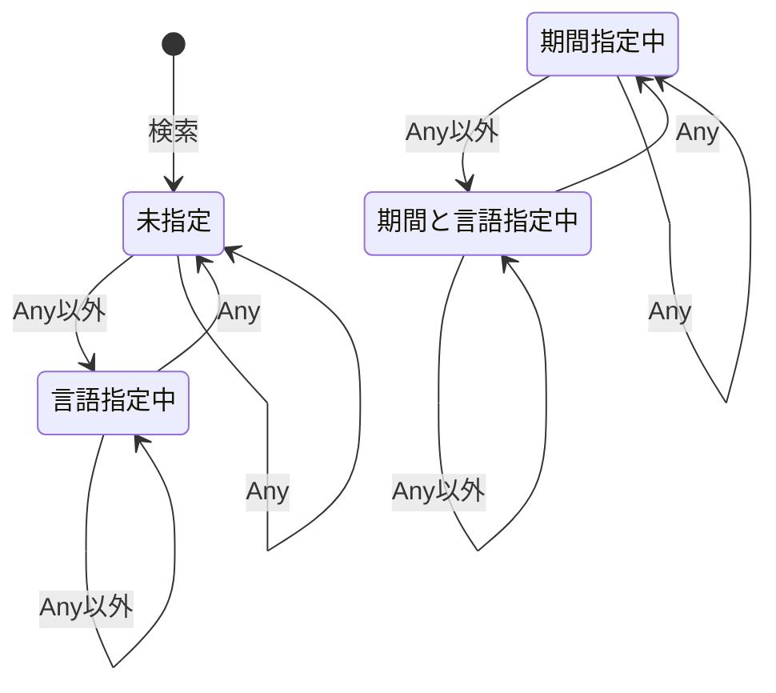
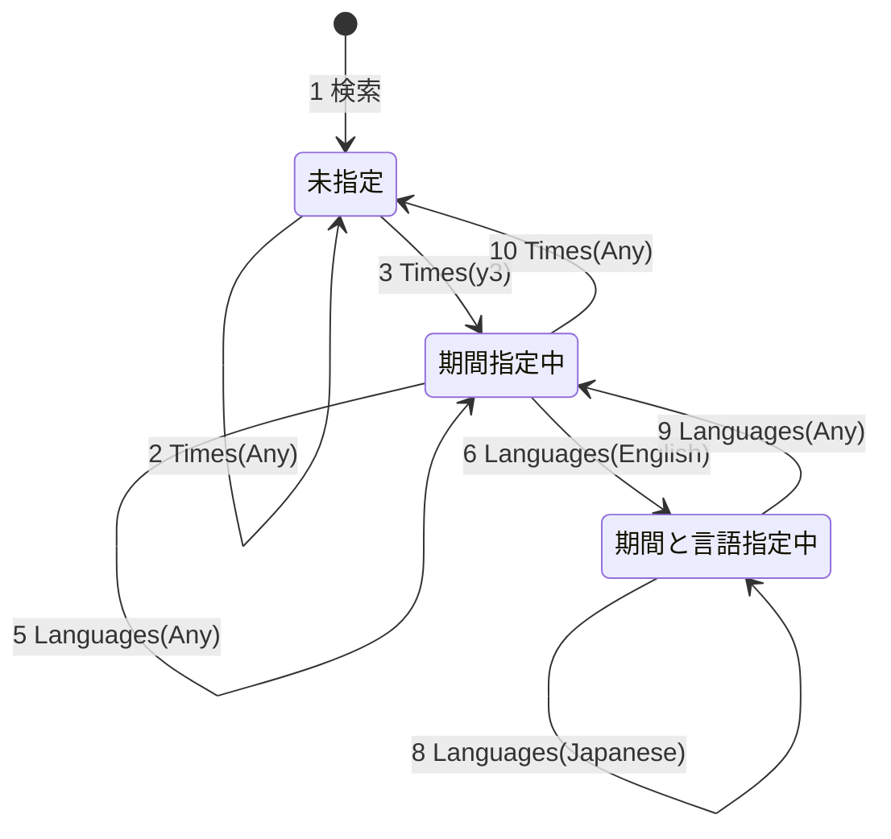
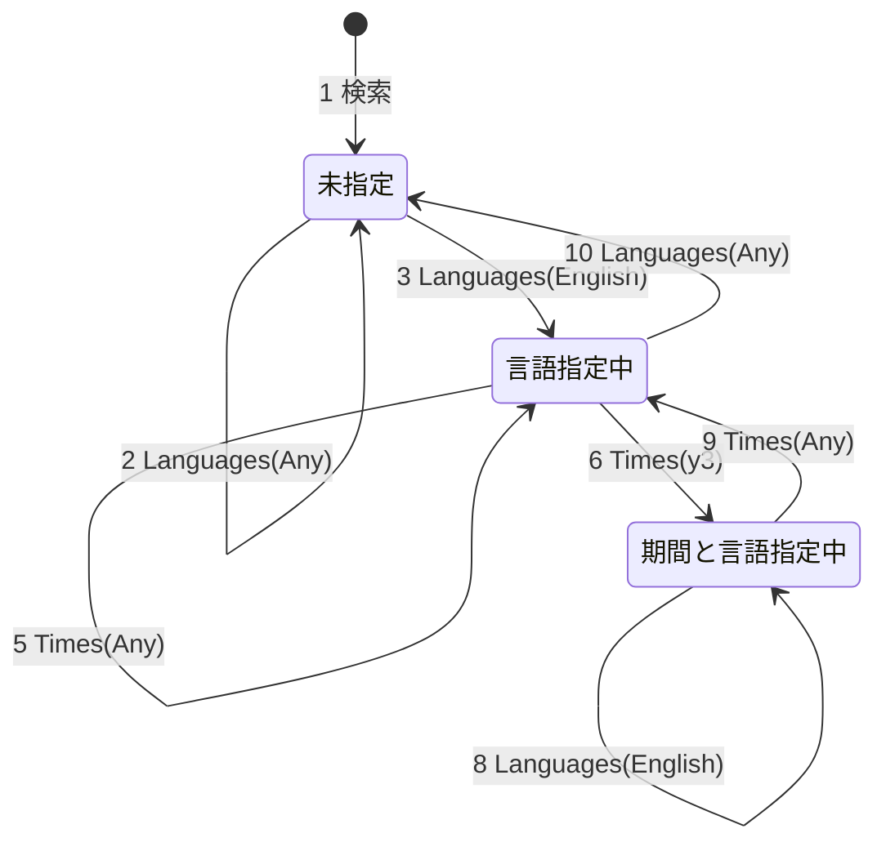

# テスト

## 状態遷移表

縦軸に状態、横軸にイベントとして押したボタンを書いている。  
「−」はそのボタンを押すといくつかのパラメータのみを維持し、余計なパラメータを削除したURLに遷移する。
状態そのものは変わらない。

|                  | Times(Any) | Times(Any以外)   | Languages(Any) | Languages(Any以外) |
|------------------|------------|------------------|----------------|--------------------|
| 未指定           | −          | 期間指定中       | −              | 言語指定中         |
| 期間指定中       | 未指定     | 期間指定中       | −              | 期間と言語指定中   |
| 言語指定中       | −          | 期間と言語指定中 | 未指定         | 言語指定中         |
| 期間と言語指定中 | 言語指定中 | 期間と言語指定中 | 期間指定中     | 期間と言語指定中   |

## 状態遷移図

期間ボタンを押したときの状態遷移図

言語ボタンを押したときの状態遷移図

## テストケース

設定項目

| 期間指定  | 言語指定  | 検索の種類 |
|-----------|-----------|------------|
| 初期(Any) | 初期(Any) | すべて     |
| Any       | Any       | isch       |
| y3        | English   | nws        |
| m1        | Japanese  | vid        |
| −         | −         | other      |

### テストケース1
期間指定を中心に遷移する。

| 手順 | 遷移前の状態                   | 発生させるイベント  | 期待結果(遷移後の状態)         |
|------|--------------------------------|---------------------|--------------------------------|
| 1    |                                | 検索                | 未指定                         |
| 2    | 未指定                         | Times(Any)          | 未指定                         |
| 3    | 未指定                         | Times(y3)           | 期間(y3)指定中                 |
| 4    | 期間(y3)指定中                 | Times(m1)           | 期間(m1)指定中                 |
| 5    | 期間(m1)指定中                 | Languages(Any)      | 期間(m1)指定中                 |
| 6    | 期間(m1)指定中                 | Languages(English)  | 期間(m1)と言語(English)指定中  |
| 7    | 期間(m1)と言語(English)指定中  | Times(y3)           | 期間(y3)と言語(English)指定中  |
| 8    | 期間(m1)と言語(English)指定中  | Languages(Japanese) | 期間(y3)と言語(Japanese)指定中 |
| 9    | 期間(y3)と言語(Japanese)指定中 | Languages(Any)      | 期間(y3)指定中                 |
| 10   | 期間(y3)指定中                 | Times(Any)          | 未指定                         |

### テストケース2
言語指定を中心に遷移する。

| 手順 | 遷移前の状態                   | 発生させるイベント  | 期待結果(遷移後の状態)         |
|------|--------------------------------|---------------------|--------------------------------|
| 1    |                                | 検索                | 未指定                         |
| 2    | 未指定                         | Languages(Any)      | 未指定                         |
| 3    | 未指定                         | Languages(English)  | 言語(English)指定中            |
| 4    | 言語(English)指定中            | Languages(Japanese) | 言語(Japanese)指定中           |
| 5    | 言語(Japanese)指定中           | Times(Any)          | 言語(Japanese)指定中           |
| 6    | 言語(Japanese)指定中           | Times(y3)           | 期間(y3)と言語(Japanese)指定中 |
| 7    | 期間(y3)と言語(Japanese)指定中 | Times(m1)           | 期間(m1)と言語(Japanese)指定中 |
| 8    | 期間(m1)と言語(Japanese)指定中 | Languages(English)  | 期間(m1)と言語(English)指定中  |
| 9    | 期間(m1)と言語(English)指定中  | Times(Any)          | 言語(English)指定中            |
| 10   | 言語(English)指定中            | Languages(Any)      | 未指定                         |

### テストケース3
検索の種類を網羅して遷移する。

| 手順 | 遷移前の検索の種類 | 発生させるイベント | 期待結果(遷移後の検索の種類) |
|------|--------------------|--------------------|------------------------------|
| 1    |                    | 検索               | すべて                       |
| 2    | すべて             | 画像ボタン         | 画像(isch)                   |
| 3    | 画像(isch)         | ニュースボタン     | ニュース(nws)                |
| 4    | ニュース(nws)      | 動画ボタン         | 動画(vid)                    |
| 5    | 動画(vid)          | 書籍ボタン         | 書籍(bks)                    |
| 6    | 書籍(bks)          | すべてボタン       | すべて                       |
