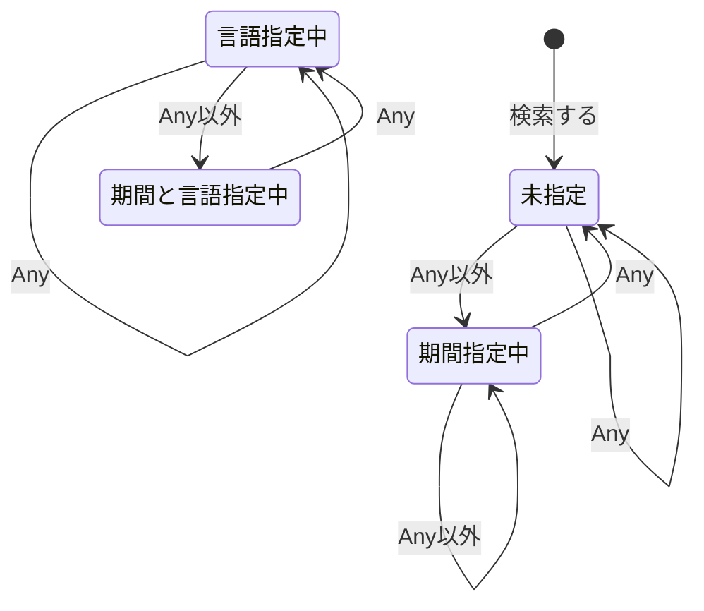
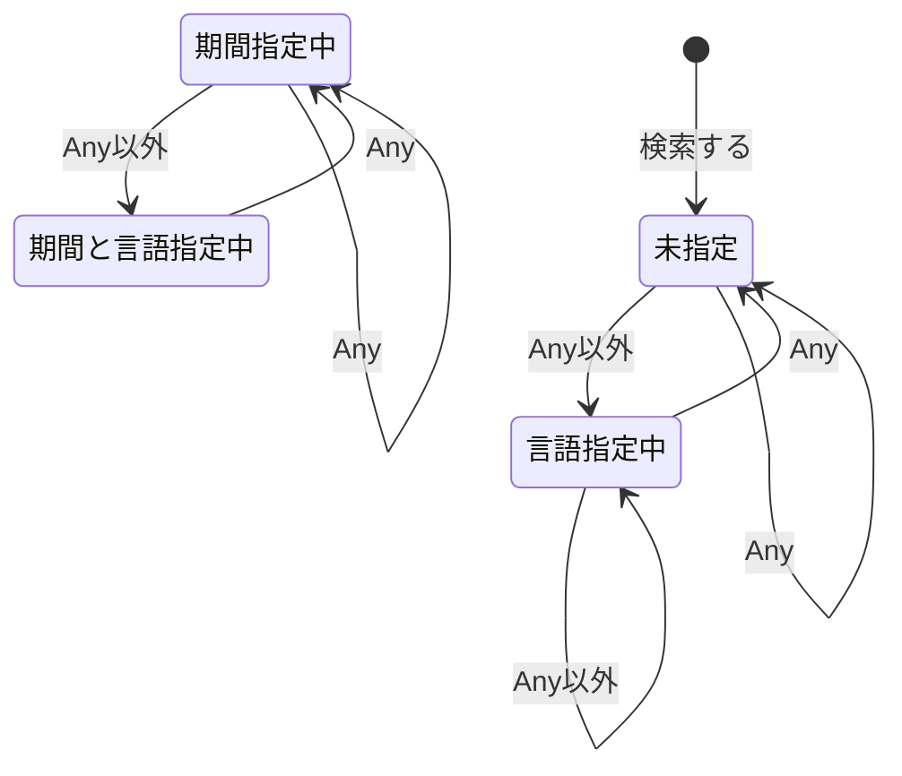

# テスト

## 状態遷移表

縦軸に状態、横軸にイベントとして押したボタンを書いている。  
「−」はそのボタンを押すといくつかのパラメータのみを維持し、余計なパラメータを削除したURLに遷移する。
状態そのものは変わらない。

|                  | Times(Any) | Times(Any以外)   | Languages(Any) | Languages(Any以外) |
|------------------|------------|------------------|----------------|--------------------|
| 未指定           | −          | 期間指定中       | −              | 言語指定中         |
| 期間指定中       | 未指定     | 期間指定中       | −              | 期間と言語指定中   |
| 言語指定中       | −          | 期間と言語指定中 | 未指定         | 言語指定中         |
| 期間と言語指定中 | 言語指定中 | 期間と言語指定中 | 期間指定中     | 期間と言語指定中   |

## 状態遷移図

期間ボタンを押したときの状態遷移図

言語ボタンを押したときの状態遷移図

